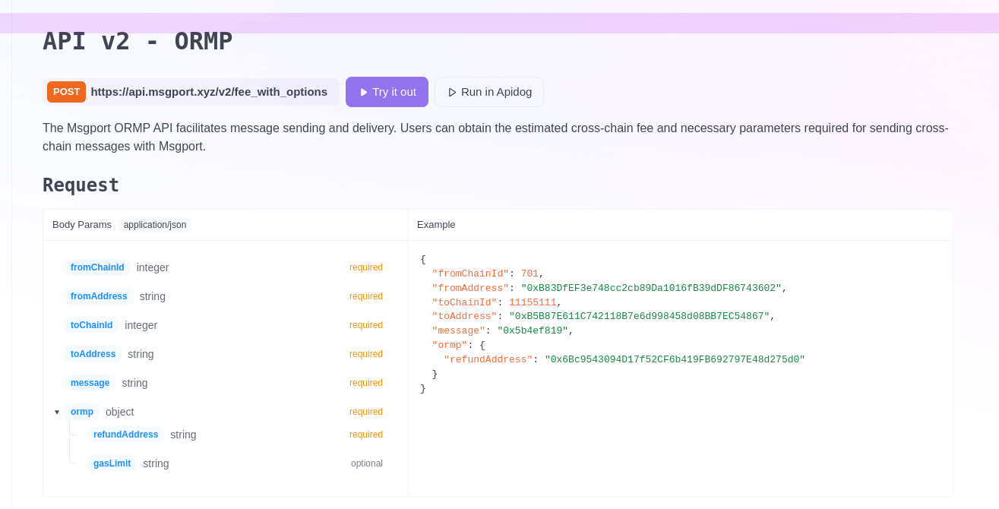
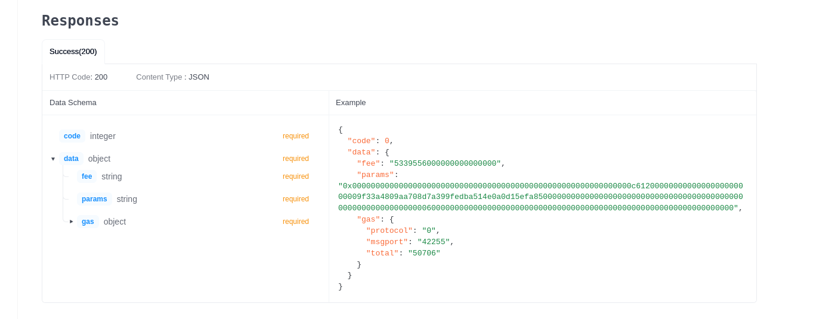

# API

!!! note
    If you're looking to explore the workings of the Msgport API more thoroughly, there is [a runnable demo](https://github.com/msgport/msgport-demo) at your disposal. This practical example serves as an excellent resource to witness the Msgport API's functionality in real-time.

The [Msgport API](https://github.com/msgport/msgport-api) serves as a specialized tool to assist Msgport Apps in acquiring additional information necessary for the message delivery process. **Its primary role is to provide an estimation of the cross-chain fee in the native token of the source chain.** This fee covers the various cross-chain expenses that Dapps are responsible for, encapsulating the costs associated with handling token value differences between chains and the delivery and execution fees incurred on both the source and destination chains. By offering the fee estimation in the source chain's native currency, the Msgport API simplifies these complexities, resulting in a seamless user experience. Users benefit from this approach as it eliminates the need for them to possess any tokens from the target chain to facilitate cross-chain transactions.

Beyond providing fee information, the API also delivers associated parameter data. These parameters are necessary for the messaging layer, which is the cross-chain messaging protocol employed by Msgport. Simply put, these parameters are the directives required by the messaging protocol's relayer to carry out cross-chain operations on the destination chain.

## Request and Response Example

The request explained below:

* API default url: `https://api.msgport.xyz/ormp/fee`
* Request method: `GET`
* Params:
    * `from_chain_id`: The source chain ID.
    * `to_chain_id`: The destination chain ID.
    * `from_address`: The application address in the source chain.
    * `to_address`: The application address in the destination chain.
    * `payload`:  The eth-abi-encoded function call, which represents the cross-chain message.
    * `refund_address`: The account that receive the potential cross-chain fee refund.

For response:

The response explained below:

- `code`: Indicates the success of the query.
- `fee`: Represents the estimated fee in the native token of the source chain, utilized when calling the send() method in the source application.
- `params`: Denotes the specific parameters required by the messaging protocol, used as the last parameter in the [`send(uint256 toChainId, address toDapp, bytes calldata message, bytes calldata params)`](./interfaces.md#imessageport) method in the source application.
- `gas`: Reflects the gas cost for the cross-chain message transition.