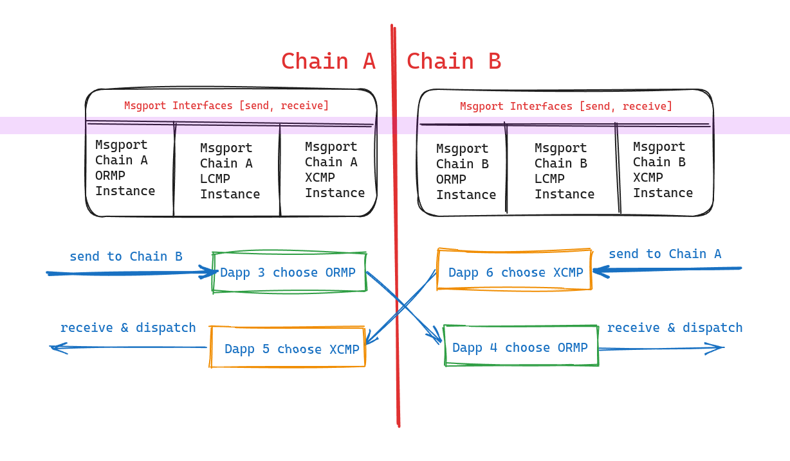

# Architecture

The current Web3 landscape is characterized by a multitude of innovative blockchain solutions, each boasting unique features and fee models based on their respective architectures. This proliferation of solutions has significantly increased the difficulty of designing a universal cross-chain messaging protocol that can seamlessly integrate with all existing blockchain systems.

As a result, applications seeking to provide services across multiple chains must often customize their approach for each chain, increasing development complexity and costs. To mitigate this issue, Msgport offers a standardized interface for cross-chain messaging, comprising a collection of smart contracts outlining standardized interfaces for facilitating a cross-chain messaging protocol.

At the heart of this system is the core interface, [IMessagePort](./build/interfaces.md#imessageport), designed with flexibility to support various implementations, known as messaging protocols. Applications integrated with Msgport can quickly switch between different messaging protocols, leveraging the benefits of each, such as lower cross-chain message fees or enhanced security.

Highlighting the three messaging protocols:

  - [ORMP](./learn/messaging-protocols/ormp.md): Oracle Relayer Messaging Protocol leverages chain-independent components, such as oracles and DApp-preferred relayers, to verify cross-chain messages. This approach integrates diverse verification mechanisms, ensuring robust and flexible cross-chain communication.
  - [LCMP](./learn/messaging-protocols/lcmp.md): Light Client Cross-Chain Messaging Protocol employs blockchain consensus mechanisms and light clients as decentralized verifiers. This ensures the integrity and accuracy of message verification across different blockchains, fostering a secure and trustless environment for message passing.
  - [XCMP](./learn/messaging-protocols/xcmp.md): Developed by Polkadot, Cross-Consensus Message Passing facilitates seamless messaging between various parachains within the Polkadot network. Messages are exchanged directly by parachains, relayed and verified by the relay chain, exemplifying efficient inter-parachain communication and interoperability.

These implementations underscore Msgport's commitment to fostering interoperability, ensuring that assets and information can navigate the complex landscape of blockchain technology smoothly.